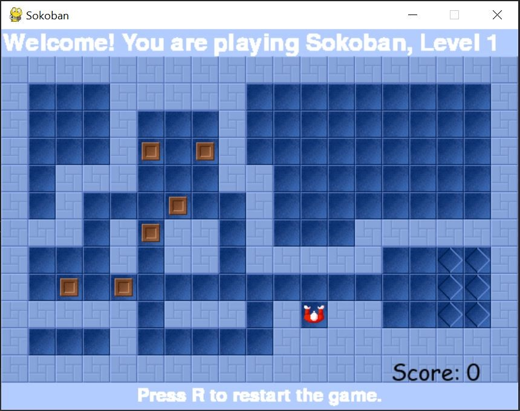

# SokobanGame
In this project I present a game named Sokoban built in Python using PyGame module.  It is an implementation of a classic puzzle video game in which the player pushes crate to storage locations. We can control the player by pressing arrow key on keyboard.  Player cannot push two crates simultaneously. After placing all crates in the storage locations, on the screen is displayed information about winning. The player can restart the game by pressing r on keyboard.
Below is a screen of game window.

